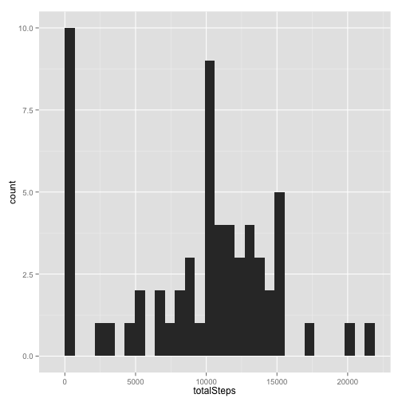

Peer Assessment 1 (Reproducible Research)
========================================================

This is a report on 17,568 observations of steps monitoring.

## Loading and preprocessing the data


```r
  library(ggplot2)
  library(plyr)
  download.file('https://d396qusza40orc.cloudfront.net/repdata%2Fdata%2Factivity.zip', 
                'activity.zip', method="curl")
  unzip('activity.zip')
  activity <- read.csv("activity.csv", stringsAsFactors=FALSE)
  activity$date <- as.Date(activity$date, "%Y-%m-%d")  
```

## What is mean total number of steps taken per day?


```r
  perDay <- setNames(aggregate(activity$steps, list(activity$date), FUN = sum, na.rm = TRUE), 
                     c('date','totalSteps')) 
  ggplot(perDay, aes(x=totalSteps)) + geom_histogram()
```

```
## stat_bin: binwidth defaulted to range/30. Use 'binwidth = x' to adjust this.
```

 

```r
  mean(perDay$totalSteps, na.rm=TRUE)
```

```
## [1] 9354
```

```r
  median(perDay$totalSteps, na.rm=TRUE)
```

```
## [1] 10395
```

## What is the average daily activity pattern?


```r
  perInterval <- setNames(aggregate(activity$steps, list(activity$interval), FUN = mean, na.rm = TRUE),
                     c('interval','avgSteps'))  
  ggplot(perInterval, aes(x=interval, y=avgSteps)) + geom_line()
```

 

```r
  subset(perInterval, subset=(avgSteps == max(perInterval$avgSteps))) 
```

```
##     interval avgSteps
## 104      835    206.2
```

## Imputing missing values

```r
  sum(is.na(activity$steps))
```

```
## [1] 2304
```

```r
  activityFilled <- ddply(activity, "interval", function(df)
    {df$steps[is.na(df$steps)] <- mean(df$steps, na.rm=TRUE); return(df)})
  perDay <- setNames(aggregate(activityFilled$steps, list(activityFilled$date), FUN = sum, na.rm = TRUE), 
                     c('date','totalSteps')) 
  ggplot(perDay, aes(x=totalSteps)) + geom_histogram()
```

```
## stat_bin: binwidth defaulted to range/30. Use 'binwidth = x' to adjust this.
```

 

```r
  mean(perDay$totalSteps, na.rm=TRUE)
```

```
## [1] 10766
```

```r
  median(perDay$totalSteps, na.rm=TRUE)
```

```
## [1] 10766
```

## Are there differences in activity patterns between weekdays and weekends?


```r
activityFilled$weekD <- weekdays(activityFilled$date)
activityFilled$dayType[activityFilled$weekD %in% c("Monday","Tuesday","Wednesday","Thursday","Friday")] <- "weekday"
activityFilled$dayType[activityFilled$weekD %in% c("Saturday","Sunday")] <- "weekend"
```
Means:

```r
activityFilledType <- ddply(activityFilled, c("dayType","interval"), summarize, steps = mean(steps))
```
Weekdays vs Weekends

```r
qplot(interval, steps, data=activityFilledType, geom="line", facets=dayType~.)
```

 


